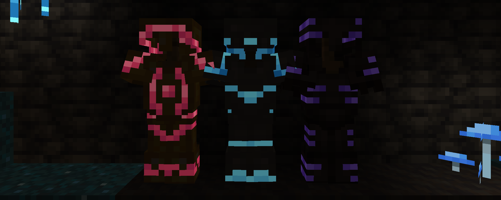

# GlowyTrims

Makes some armor trims glow/emissive.

Currently the pack only makes these 3 trims glow, see [coming soon](#coming-soon) for more info:

- Amethyst
- Glowworm Silk from [Biomes o' Plenty](https://www.curseforge.com/minecraft/mc-mods/biomes-o-plenty)
- Rose Quartz from Biomes o' Plenty

## Requirements

- [OptiFine](https://optifine.net) or [Entity Texture Features](https://modrinth.com/mod/entitytexturefeatures).  
  - If using ETF, make sure `Emissive entity textures` and `Emissive armor & trims` are enabled.

## Known issues

- Does not work with [Iris](https://modrinth.com/mod/iris)/[Oculus](https://modrinth.com/mod/oculus), even if no shader is selected. This is not an issue with the resource pack.

## Coming soon

- Configurable alpha value
- Generator website with that lets you select which and how strong materials should grow
- Multi-version support
